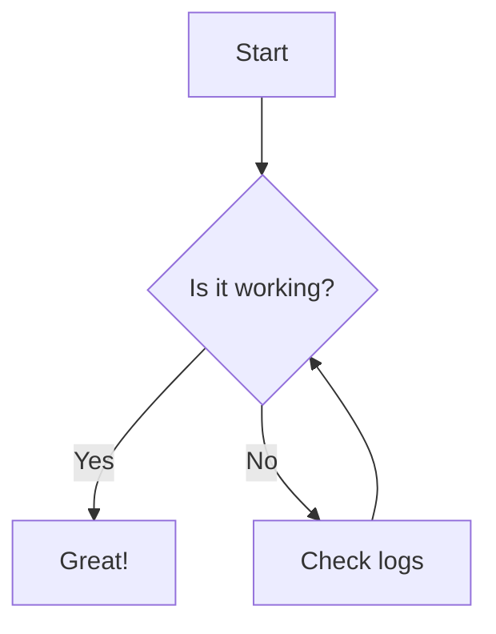

<div id="docs" className="scroll-m-20" />

Welcome to the ultimate starter for modern web documentation. This site is powered by **Vite 8**, **MDX**, and **Tailwind CSS 4**.

<div className="my-8">
  <CopyMarkdown />
</div>

## Quick Start

Get your documentation up and running in seconds. Clone the template and start writing in MDX.

<Steps>
  <Step title="Clone Template">
    Clone the repository to your local machine.

    ```bash
    git clone https://github.com/area44/vite-monopage.git
    ```

  </Step>
  <Step title="Install Dependencies">
    Install the required packages using pnpm.

    ```bash
    pnpm install
    ```

  </Step>
  <Step title="Start Developing">
    Launch the development server.

    ```bash
    pnpm dev
    ```

  </Step>
</Steps>

<Callout type="default">
  This is a custom `Callout` component. It's perfect for highlighting important information that
  doesn't fit in the standard flow.
</Callout>

## Design Philosophy

Vite Monopage is built on the principles of **clarity**, **speed**, and **readability**. Inspired by Mintlify and Shadcn UI, it provides a clean, single-page experience that puts your content first.

### Key Features

- **Blazing Fast**: Powered by Vite 8 and Rolldown for near-instant builds.
- **Modern Styling**: Tailwind CSS 4 with OKLCH colors and Inter Variable font.
- **Native MDX**: Write documentation using React components directly in Markdown.
- **Syntax Highlighting**: Beautiful code blocks powered by Shiki.
- **Diagrams**: Built-in support for **Mermaid.js** diagrams.

### Image Preview

Images are automatically enhanced with a click-to-zoom preview feature.


## Interactive Components

### Diagrams (Mermaid)

Vite Monopage supports Mermaid diagrams natively in code blocks. Just use the `mermaid` language tag.



### Code Blocks

We use **Shiki** for high-quality syntax highlighting. It supports hundreds of languages and themes.

```typescript
interface User {
  id: string;
  name: string;
  email: string;
}

const getUser = async (id: string): Promise<User> => {
  const response = await fetch(`/api/users/${id}`);
  return response.json();
};
```

### GFM Alerts

We support GitHub Flavored Markdown alerts natively.

> [!TIP]
> This is a tip alert. Perfect for providing helpful advice or shortcuts.

> [!WARNING]
> This is a warning alert. Use this to signal potential issues to your users.

## Project Structure

| Directory        | Purpose                           |
| :--------------- | :-------------------------------- |
| `src/app`        | Main application logic and layout |
| `src/components` | UI and MDX components             |
| `src/pages`      | Documentation content in MDX      |
| `src/styles`     | Global CSS and design tokens      |

---

<Callout type="success">
  **Ready to build?** Edit `src/pages/index.mdx` and start building your own documentation today.
</Callout>
