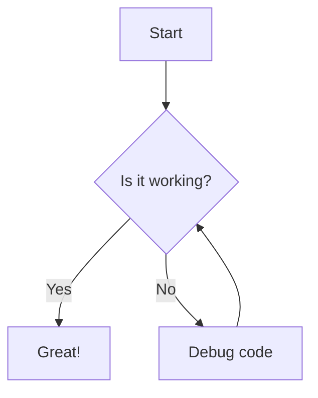

Use it as a reference while building any long-form content.

## Headings

Headings create a clear document hierarchy and automatically include anchor links for easy navigation.

<ComponentPreview caption="Different heading levels from h1 to h6">

# Heading 1

## Heading 2

### Heading 3

#### Heading 4

##### Heading 5

###### Heading 6

```mdx
# Heading 1

## Heading 2

### Heading 3

#### Heading 4

##### Heading 5

###### Heading 6
```

</ComponentPreview>

## Paragraphs & Inline Elements

Markdown inline formatting is styled consistently throughout your content.

<ComponentPreview caption="Common inline elements for rich text styling">

- **Bold** highlights important information.
- _Italic_ adds emphasis to text.
- `Inline code` is ideal for commands, filenames, and variables.
- **Combined _formatting_** works naturally.
- [Hyperlinks](https://en.wikipedia.org/wiki/Hyperlink) inherit the theme and include accessible hover and focus states.

```mdx
- **Bold** highlights important information.
- _Italic_ adds emphasis to text.
- `Inline code` is ideal for commands, filenames, and variables.
- **Combined _formatting_** works naturally.
- [Hyperlinks](https://en.wikipedia.org/wiki/Hyperlink) inherit the theme and include accessible hover and focus states.
```

</ComponentPreview>

## Images

Images automatically scale responsively and blend seamlessly with surrounding content.

<ComponentPreview caption="A responsive image showcase with smooth styling">


```mdx

```

</ComponentPreview>

## Code Blocks

Code blocks include syntax highlighting, support for custom filenames/titles, line numbering, and easy copy-to-clipboard functionality.

### Standard Code Block

<ComponentPreview caption="A standard Rust code block">

```rust
fn main() {
    println!("Hello, world!");
}
```

````mdx
```rust
fn main() {
    println!("Hello, world!");
}
```
````

</ComponentPreview>

### Code Block with Title

<ComponentPreview caption="Code block showcasing a custom title metadata">

```rust title="src/main.rs"
fn main() {
    println!("Hello, world!");
}
```

````mdx
```rust title="src/main.rs"
fn main() {
    println!("Hello, world!");
}
```
````

</ComponentPreview>

### Code Block with Title and Line Numbers

<ComponentPreview caption="Code block showcasing both custom title and line numbering metadata">

```rust title="src/main.rs" showLineNumber
fn main() {
    println!("Hello, world!");
}
```

````mdx
```rust title="src/main.rs" showLineNumber
fn main() {
    println!("Hello, world!");
}
```
````

</ComponentPreview>

## Tables

Tables present structured information in a clean, responsive layout.

<ComponentPreview caption="Clean, responsive and theme-aware tables">

| Property   | Type     | Default     | Description                        |
| :--------- | :------- | :---------- | :--------------------------------- |
| `size`     | `string` | `"15px"`    | Base font size.                    |
| `leading`  | `number` | `1.75`      | Global line height.                |
| `flow`     | `string` | `"1.25em"`  | Vertical spacing between elements. |
| `fontMono` | `string` | `undefined` | Custom monospace font family.      |

```mdx
| Property   | Type     | Default     | Description                        |
| :--------- | :------- | :---------- | :--------------------------------- |
| `size`     | `string` | `"15px"`    | Base font size.                    |
| `leading`  | `number` | `1.75`      | Global line height.                |
| `flow`     | `string` | `"1.25em"`  | Vertical spacing between elements. |
| `fontMono` | `string` | `undefined` | Custom monospace font family.      |
```

</ComponentPreview>

## Lists

Ordered and unordered lists support nesting and code blocks.

<ComponentPreview caption="Ordered and nested lists with inline formatting">

1. **Prerequisites & Setup**
   - Ensure [Node.js](https://nodejs.org/en) is installed on your local development machine.
   - Install the project package manager globally:
     1. Run `npm install -g pnpm`
     2. Verify the installation via `pnpm --version`
2. **Local Environment Deployment**
   - Clone the source repository to your workspace.
   - Run initial package installation:
     ```bash
     pnpm install
     ```
   - Launch the modern development server:
     - Use `pnpm dev` for local hot-reloads.
     - View the application live at `http://localhost:5173`.
3. **Production Distribution**
   - Run the compiler build task:
     ```bash
     pnpm build
     ```

````mdx
1. **Prerequisites & Setup**
   - Ensure [Node.js](https://nodejs.org/en) is installed on your local development machine.
   - Install the project package manager globally:
     1. Run `npm install -g pnpm`
     2. Verify the installation via `pnpm --version`
2. **Local Environment Deployment**
   - Clone the source repository to your workspace.
   - Run initial package installation:
     ```bash
     pnpm install
     ```
   - Launch the modern development server:
     - Use `pnpm dev` for local hot-reloads.
     - View the application live at `http://localhost:5173`.
3. **Production Distribution**
   - Run the compiler build task:
     ```bash
     pnpm build
     ```
````

</ComponentPreview>

## Blockquotes

Blockquotes help emphasize notes, quotations, or highlighted content.

<ComponentPreview caption="Clean blockquote typography with standard borders">

> Simplicity is the ultimate sophistication.

```mdx
> Simplicity is the ultimate sophistication.
```

</ComponentPreview>

## Callouts

Callouts help draw attention to important information.

<ComponentPreview caption="A selection of theme-tinted Callout elements">

<Callout type="default">This is a standard informational callout.</Callout>

<Callout type="success">Use success callouts for completed steps or positive outcomes.</Callout>

<Callout type="warning">Warnings highlight important considerations before continuing.</Callout>

<Callout type="error">Errors indicate problems that require attention.</Callout>

```mdx
<Callout type="default">This is a standard informational callout.</Callout>

<Callout type="success">Use success callouts for completed steps or positive outcomes.</Callout>

<Callout type="warning">Warnings highlight important considerations before continuing.</Callout>

<Callout type="error">Errors indicate problems that require attention.</Callout>
```

</ComponentPreview>

## Steps

The custom `Steps` component provides a structured way to document workflows.

<ComponentPreview caption="Custom Steps workflow display">

<Steps>

<Step>Install the package</Step>

Install your project dependencies.

```bash
pnpm install
```

<Step>Configure the styles</Step>

Import the stylesheet into your application.

```css
@import "tailwindcss";
@import "./typeset.css";
```

<Step>Start writing</Step>

Wrap your Markdown or MDX content with the provided typography classes.

</Steps>

````mdx
<Steps>

<Step>Install the package</Step>

Install your project dependencies.

```bash
pnpm install
```

<Step>Configure the styles</Step>

Import the stylesheet into your application.

```css
@import "tailwindcss";
@import "./typeset.css";
```

<Step>Start writing</Step>

Wrap your Markdown or MDX content with the provided typography classes.

</Steps>
````

</ComponentPreview>

## Math

Both inline and display equations are rendered using KaTeX.

<ComponentPreview caption="Inline and block equations rendered via KaTeX">

- **Inline Math**: You can write equations inline like $E = mc^2$ or the quadratic formula $x = \frac{-b \pm \sqrt{b^2 - 4ac}}{2a}$ within continuous prose.
- **Display Math**: For complex equations, use display block rendering. Here is Maxwell's equations as an example:

$$
\nabla \cdot \mathbf{E} = \frac{\rho}{\varepsilon_0}
$$

```mdx
- **Inline Math**: You can write equations inline like $E = mc^2$ or the quadratic formula $x = \frac{-b \pm \sqrt{b^2 - 4ac}}{2a}$ within continuous prose.
- **Display Math**: For complex equations, use display block rendering. Here is Maxwell's equations as an example:

$$
\nabla \cdot \mathbf{E} = \frac{\rho}{\varepsilon_0}
$$
```

</ComponentPreview>

## Mermaid Diagrams

You can generate dynamic, interactive diagrams and flowcharts directly inside MDX using standard Mermaid code blocks.

<ComponentPreview caption="Flowchart rendered dynamically using Mermaid.js">


```mermaid
flowchart TD
    A[Start] --> B{Is it working?}
    B -- Yes --> C[Great!]
    B -- No --> D[Debug code]
    D --> B
```

````mdx

```mermaid
flowchart TD
    A[Start] --> B{Is it working?}
    B -- Yes --> C[Great!]
    B -- No --> D[Debug code]
    D --> B
```
````

</ComponentPreview>

## GitHub Flavored Markdown

Additional GFM features are fully supported.

<ComponentPreview caption="Standard GFM formatting features">

- ~~Strikethrough~~
- Task lists
  - [x] Typography
  - [x] Components
  - [ ] Deployment
- Footnotes[^1]

[^1]: This is an example footnote.

```mdx
- ~~Strikethrough~~
- Task lists
  - [x] Typography
  - [x] Components
  - [ ] Deployment
- Footnotes[^1]

[^1]: This is an example footnote.
```

</ComponentPreview>

Native GitHub alerts are also supported.

<ComponentPreview caption="GFM native alert blockquotes converted to custom Callouts">

> [!NOTE]
> Useful information for readers.

> [!TIP]
> Helpful suggestions or best practices.

> [!WARNING]
> Important information that should not be ignored.

> [!CAUTION]
> Actions that may have unintended consequences.

```mdx
> [!NOTE]
> Useful information for readers.

> [!TIP]
> Helpful suggestions or best practices.

> [!WARNING]
> Important information that should not be ignored.

> [!CAUTION]
> Actions that may have unintended consequences.
```

</ComponentPreview>
